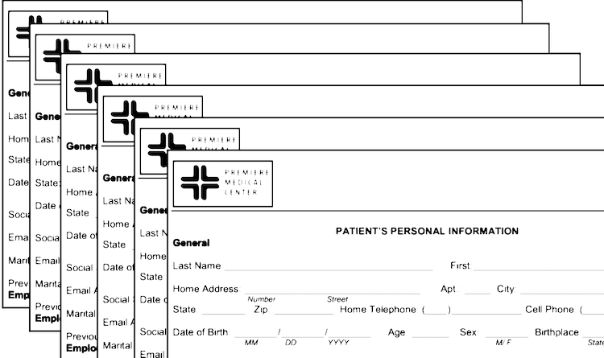
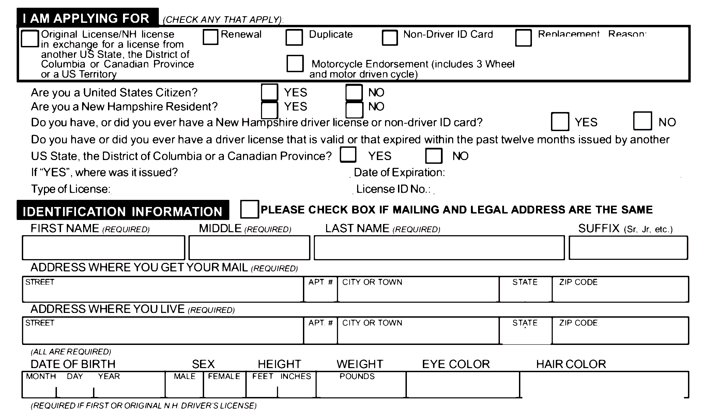

\maketitle
\thispagestyle{empty}

\clearpage

\begin{center}
this page left intentionally blank
\end{center}

\clearpage 

> *Trigger warnings: discussions of job precarity, medical establishment, medication and needles, blood, and gender dysphoria.*

\clearpage

<!-- \ref{page:home} -->

Your name is Bo. You're a non-binary person of Asian descent. You live with someone you went to high school with in a nondescript two-bedroom house in Fort Wayne, Indiana, USA.

You wake up one day and find it incredibly difficult to get the thought of medical transition out of your head. You don't really know what that means for you yet. On a lark, you call your doctor to schedule an appointment. And, surprisingly, they happen to have an opening that day.

<!-- 
To go to work, go to page \pageref{page:work}.

To call in sick and go to the doctor, go to page \pageref{page:doctor}.

-->

To go to work, go to page 5.

To call in sick and go to the doctor, go to page 6.

\clearpage

<!-- \ref{page:work} -->

You toss on jeans and a baggy sweater and shove a toque atop your short hair. You start the coffee machine and sit in silence as the machine works, staring at the formica table in the kitchen. You're late but couldn't give a shit. Your old Toyota struggles to shake off the cold of February in Indiana. 15 minutes later, you pull into the parking lot of the steel mill.

You clock in and feel your boss's eyes bore into you from the office suspended above the shop floor. He comes down several minutes later.

"Hey Chang." In a show of unwitting mercy, he uses your family name instead of that name you hate. "Having trouble getting here in the cold?"

You shrug without looking at him, "Yeah."

He grimaces and walks off without a word more.

You work 8 hours between operating the forklift, lifting packages, and cleaning shavings.

God, fuck this job.

<!-- To go back home and start a new day, go to page \ref{page:home}. -->

To go back home and start a new day, go to page 4.

\clearpage

<!-- \ref{page:doctor} -->

You sit down to fill in the intake form at the clinic not far from your apartment. There's an aquariaum inset into the wall. The wallpaper is that pastel pink (is this mauve?) that was popular in the 70's. There's two other people there, including a small child who looks like your niece. You write down a name you abhor and then think about what to do about the "sex" box.

    [ ] Male [ ] Female

<!-- To mark Male, go to page [2](#p2).

To mark Female, go to page [3](#p3).

To leave it blank, go to page [4](#p4). -->

To mark Male, go to page 7.

To mark Female, go to page 8.

To leave it blank, go to page 9.

\clearpage

<!-- \ref{page:doctor-male} -->

You check the Male box, even though it makes you deeply uncomfortable. You grit your teeth as the receptionist looks down at the form, scans it, and doesn't give you a second look. 

<!-- After five more minutes, the nurse calls you into the exam room. Go to page [5](#p5). -->

After five more minutes, the nurse calls you into the exam room. Go to page 10.

\clearpage

<!-- \ref{page:doctor-afab} -->

You sigh and check off the gender you had been assigned at birth. You grit your teeth as the receptionist looks down at the form, scans it, and doesn't give you a second look. 

<!-- After five more minutes, the nurse calls you into the exam room. Go to page [5](#p5). -->

After five more minutes, the nurse calls you into the exam room. Go to page 10.

\clearpage

<!-- \ref{page:doctor-none} -->

You look from side to side and then elect to leave the sex box blank. You grit your teeth as the receptionist looks down at the form and scans it. She looks up from the form to you and then moves her pen quickly. You wince.

<!-- After five more minutes, the nurse calls you into the exam room. Go to page [5](#p5). -->

After five more minutes, the nurse calls you into the exam room. Go to page 10.

\clearpage

<!-- \ref{page:p5} -->

The nurse takes your blood pressure and asks what brought you in. You mumble something about hormones and gender. She nods and then leaves. Another five minutes pass and you hear the nurse and the doctor briefly converse outside the door. The contents of their conversation are opaque to you, but you briefly hear the Doctor use the pronoun "she" to refer to you.

After a moment, Doctor Cismandy opens the door and you shake her hand. She smiles and asks what brought you in today. You mumble something about hormones and gender again. Even though you're non-binary, you said that you want to transition to be male.

She nods and remarks that you need to be presenting as Male for [at least a year](https://en.wikipedia.org/wiki/Real-life_experience_(transgender)) before she can prescribe you any medication. You grit your teeth. She sees your discomfort and  says, almost defensively, that according to the Standards of Care, you have to meet a "real-life experience" requirement.

You're annoyed. To add insult to injury, as you leave, the receptionist hands you an explanation of benefits.

Under "reasons for visit" it states
  
    GENDER IDENTITY DISORDER.

You go home.

<!-- To go online, go to page [6](#p6). -->

To go online, go to page 11.

\clearpage

<!-- \ref{page:p6} -->

You've been part of an online community discussing non-binary transition for a while. You log on and fume about your experience to other people there. They relate similar experiences, saying it got better when they moved or when they found another doctor. Someone tips you off to an endocrinologist in Indianapolis who doesn't force the one-year requirement on their patients. Indianapolis, though, is a 4-hour drive each way. You'll have to take time off work to go.

There is another option. One of your friends mentioned an online pharmacy where you can get testosterone through the mail. You visited the site once -- there was a lot of writing in Cyrillic that you couldn't read but managed to figure out with Google Translate. You've still got the site bookmarked. Testosterone is a controlled substance in the US, so you're afraid someone's tracking you somehow.

<!-- 
To go the endocrinologist, go to page [8](#p8).

To go the online pharmacy site, go to page [7](#p7). 
-->

To go the endocrinologist, go to page 13.

To go the online pharmacy site, go to page 12.

\clearpage

<!-- \ref{page:p7} -->

You open a Private Browsing window in your web browser and click on the bookmarked site on your computer, called [CheapOnlinePharma](https://www.theatlantic.com/health/archive/2016/08/diy-hormone-replacement-therapy/498044/). You navigate a few of the links and add a 30-day supply of Depo-Testosterone plus some syringes and needles to your cart. At the ordering page, you hesitant for a second but then enter in your credit card number. Your mouse hovers over the submit button for a moment.

<!-- To click <code>Submit</code>, go to page [9](#p9). -->

To click <code>Submit</code>, go to page 14.

\clearpage

<!-- \ref{page:p8} -->

You call the endrocrinologist and they tell you that you won't be able to get in for *three months*. Holy shit.

"Do you want to schedule an appointment?" the receptionist asks.

You pause and look at the bookmarked online pharmacy on your computer. 

<!-- 
To say "Yes", go to page [11](#p11).

To decline and order from the online pharmacy, go to page [7]. 
-->

To say "Yes", go to page 16.

To decline and order from the online pharmacy, go to page 12.

\clearpage

<!-- \ref{page:p9} -->

*Click*. CheapOnlinePharma thanks you for your order.

Three incredibly slow weeks later, a thick plastic package wound in layers of tape shows up at your apartment. It's light and feels like it's full of bubblewrap.

You take it inside your apartment and quickly cut through the gobs of tape. You sit on the floor as you carefully unroll all the components on a low IKEA table. There's the vial of hormones, then the syringes, the needles for drawing out of the vial and the needles for plunging into your thigh.

<!-- Continue to page [10](#p10). -->

Continue to page 15.

\clearpage

<!-- \ref{page:p10} -->

Your mind buzzes and your shins seize with fear and anticipation. You draw out the amount that most of your friends online seemed to agree on, flipping the vial upside down and flicking it like you've seen on YouTube and all those doctor shows. You climb up to the arm of your couch and pull down your pants to expose your thigh. You inhale and plunge.

There's a little shock as you push the long needle in and plunge the oily fluid into your muscle. You remove the needle, put a bandaid over the hole, and wait... 

\begin{small} wait ...\end{small}  

\begin{footnotesize} wait. \end{footnotesize}

A few hours later you start to feel nauseous. You spend the rest of the evening curled up on the couch wrapped in a blanket.The next day you wake up with a massive headache and a dry throat. You're not really sure what was in that vial.

Your online community says it takes a few weeks to see any masculinizing effect, but you're not sure if you want to continue risking it with your DIY hormone replacement therapy.

To continue taking your online meds, go to page 19.

To book an appointment with the endrocrinologist, go to page 13.

<!-- Go to page \pageref{page:p}. -->

\clearpage

<!-- \ref{page:p11} -->

You book an appointment and wait for the day to come. Miraculously, the clinic's services are covered under your company's insurance plan. You've taken the day off of work, which is a move that annoys your boss. In the intervening time you both start to become more impatient with each other. He's annoyed at you and you're annoyed at how long this appointment is taking to come up. 

The day comes, though, and you set out at 4 AM having barely slept. You sit in the clinic, watching the local newscast. A nurse calls you into the office by your name -- your actual name! the one you wanted to use! -- and you wait for the doctor after the nurse takes your vitals.

There's a knock at the door and then someone enters. Dr. Pineal comes in with a smile, a middle-aged woman with wavy hair lined with gray streaks.

<!-- Continue on page [12](#p12). -->

Continue on page 17.

\clearpage

<!-- \ref{page:p12} -->

You stumble through the typical reasons you want to get on hormones. Dr. Pineal smiles and navigates you through what the typical process would be. After asking some basic questions about your medical history, she begins to ask you difficult personal questions about your identity. All you're thinking about is trying to answer the questions correctly. Finally, she orders up several blood labs and tells you to go downstairs for them to do the blood draws.

At the end of the appointment she says that you will have to come back for a second visit for her to prescribe anything for you. Your stomach sinks and blood rushes to your ears. Everything sounds a bit muffled. You shuffle back to the receptionist who, at the very least, allows you to schedule a much quicker follow-up appointment. 

On the drive back home, you wonder if you should just try that online pharmacy instead. It wouldn't take so many steps, and you wouldn't need to make that second trip.

<!-- To go the online pharmacy site, go to page [7](#p7).

To wait for your appointment, go to page [13](#p13). -->

To go the online pharmacy site, go to page 12.

To wait for your appointment, go to page 18.

\clearpage

<!-- \ref{page:p13} -->

You've missed the window to request off for your job, so when the day comes for your next appointment you call in sick. You make the dark, boring drive at 4 AM, down I-69 and through the urban traffic and are again back in the appointment room. Your eyes are heavy and you're coming down with a cough. Maybe you actually are sick. 

Dr. Pineal comes in with a smile and sits on a stool. 

"Your bloodwork came out great. We're ready to go forward."

You light up. After all this red tape, you're actually able to get to your hormones. 

She writes you your prescription and says you'll need to do your bloodwork in 30 more days. Luckily, you can do this at a clinic in Fort Wayne. You head to the pharmacy next to the clinic and pick up a small vial, some syringes, and two sets of needles.

As you're about to start your car to go home, you get a text from your boss:

    "dont worry about coming in tomorrow. or the day after"

Well, shit.

**The End**

<!-- Go to page \ref{page:about}. -->

Go to page 20.

\clearpage

The next week you prep your shot from the vial and hesitate again before pushing the oily T into your muscle. You don't know what that initial wave of nausea was and you're worried it'll happen again. But this time, you don't have the same reaction. The next week's shot goes by without incident. And the next.

You reorder your meds from the online pharmacy, happy that the site hasn't been shut down yet. Another month goes by.

You've started to see some more hair on your face. Your skin gets more oily. But in the back of your mind you wonder if you'll get sick again, or the site will get shut down, or some fed will bust you on some bogus charge. But you're getting where you want to be, although in a constant state of anxiety over your health and safety.

**The End**

<!-- Go to page \ref{page:about}. -->

Go to page 20.

\clearpage

\section*{ON ADMINISTRATIVE VIOLENCE}

<!-- \ref{page:about} -->

You go to the doctor's office, you buy an airline ticket, you go to the Department of Motor Vehicles. You're asked to fill out a form which asks a common set of information. Name, address, gender, insurance policy number, employer's name and address. In many instances, each piece of this information may be rote, at worst annoying. But for those who move through the world in the most marginalized of bodies -- people who are Black, brown, undocumented, unhoused, unemployed, disabled, and/or transgender/gender non-conforming -- filling out these documents out means making a commitment to a categorization which may contribute to serious harms to their person and livelihood.

This zine is about how practices and routines which are typically considered banal -- bureaucratic and administrative records -- reduce the life chances for those who are already marginalized by structural racism, sexism, transphobia, homophobia, xenophobia, and ableism. The term "administrative violence", coined by legal scholar Dean Spade, refers to the harms created by forcing oneself into narrow categories of gender for the purpose of having ones basic needs met, due to the constraints and understandings of the administrative subject by governments, welfare agencies, and health care organizations. Gender is only one of the categories we try to fit ourselves into. Any given paper form forces transgender people to write a name they may not use in everyday life and which may not match their birth certificate. That form may also force someone who is unhoused to list an address at which they are staying temporarily, or someone who is undocumented to pause and wonder how and if they should disclose that fact.

Administrative violence becomes piqued for trans and gender non-conforming people and can be especially harmful to trans people of color. This typically occurs at the level of identity documents, sex-segregated facilities, and health care access. Rules for changing identity documents have inconsistent rules across municipalities, states, and countries. Some require a doctor's note, while some require surgery or certification from another authoritative body. This results in a web of confusing twists and turns, looping back to other agencies with no uniform method of updating documents. Dean Spade outlines an example of this kind of morass[^spade2009]:

> ...one person born in New York and living in New York might have a birth certificate she cannot change from "M" to "F" because she has not had gential surgery: a driver's license that correctly reflects "F" because she got a doctor's letter; Social Security records that say "M" because she cannot produce evidience of surgery; a name change order that shows her new feminine name; and a Medicaid card that reads "F" because the agency had no official policy and the clerk felt the name change order and driver's license were sufficient. [pp. 79]

[^spade2009]: Spade, Dean., 2015. *Normal life: Administrative violence, critical trans politics, and the limits of law*. Duke University Press.

Administrative violence further acts at the level of sex-segregated facilities. Misclassification of trans people, especially trans women, limits their ability to access care facilities, such as homeless shelters and drug rehabilitation center. This often places trans women into men's facilities, putting them in situations in which they face disproportionate levels of violence from both residents and staff. Trans people also encounter administrative violence at the level of health care, where a misclassification based on one's sex assigned at birth and/or the diagnosis of being trans at all can deny trans people the care for common gender-affirming medications and procedures.

\subsection*{On Surveillance}

The student of a computer science professor interested in training a facial recognition model came across a series of videos in which trans YouTubers documented their transition on the platform. As an "edge case" in the machine learning task, they gathered these videos en masse. The motivation for this project was to understand "[w]hat kind of harm can a terrorist do if they understand that taking this hormone can increase their chances of crossing over into a border that’s protected by face recognition." [^vincent2017]

Trans bodies and lives are continually held in suspicion; the professor in question framed the transition videos -- which are often tools for self-expression and motivation for others -- to be a vector for potential terrorist and cross-border subversion. In this context, the suspicion of the trans body becomes especially piqued for undocumented trans people and trans people of Arab, Iranian, and central Asian descent. The processes of administrative violence should not be characterized as simply a category error in which correct classifications can be updated by administrative remedy. It is not a matter of ensuring the identity documents are harmonized across bureaucracies and organizations. Administrative violence occurs more frequently as surveillance infrastructures become more entrenched.

The elimination of the surveillance of queer bodies cannot be overlooked in the kinds of politics which aim to amerliorate administrative violence. As Dean Spade continues in *Normal Life*:

> a critical understanding of surveillance allows us to avoid making simplistic demands to have these policies "fixed" so that trans people can be more "accurately" classified. Rather, this analysis allows for the emergence of politics and resistance strategies that understand the expansion of identity verification as a key facet of racialized and gendered maldistribution of security and vulnerability. [Spade 2015, pp. 87]

To put it simply, fixing identity documents will typically only benefit those trans people who are already well-served by other administrative structures -- typically those who are white, wealthy, and have access to medical procedures which comport them with an ideal trans subject.

[^vincent2017]: Vincent, James. 2017. Transgender YouTubers had their videos grabbed to train facial recognition software. *The Verge*. \url{https://www.theverge.com/2017/8/22/16180080/transgender-youtubers-ai-facial-recognition-dataset}

\subsection*{On Systems and Legibility}

Considering the harms caused by misclassification is a path that has been well-trodden by the recent focus on algorithmic fairness. This conversation typically has revolved around correcting for disparate error rates across different racialized or gendered groups. However, as others have pointed out[^hoffmann2019], this discussion typically grounds itself in frameworks which rely on the individualist focus of US anti-discrimination law and the treatment of both advantaged and disadvantaged groups as equally needing of remediation.

The problem itself isn't about fairness, but instead a state that rationalizes individuals in such a way to make them legible for surveillance, overpolicing, medical gatekeeping, and denial of housing and employment. The state itself operates in such a way that collects data on individuals and uses automated tools which aren't structured for the benefit of the most marginalized. As James C. Scott discusses, almost as soon as humans began living in agriculturally-based communities, it became necessary to count the number of people living under the control of a certain party[^scott1998]. He argues how the transition to highly hierarchical, regimented, and predictable nation-states made it necessary to count those people living within those political entities. States aim to "make legible" people who live within their borders -- that is, to make data from those people for the purpose of sorting and categorizing them.

For instance, state functions such as welfare provision require data on welfare recipients and obtain those data by collecting their income, their housing situation, and their family structures through administrative forms or administrative records they've gained through social provision agencies. It's not a coincidence that the character in this zine lives in Indiana, where Virginia Eubanks documents the failure of a welfare system aimed at providing medical and welfare benefits to its most destitute[^eubanks2018]. In that example, the Indiana welfare system failed to address citizen concerns and offer reasonable recourse in the cases of dropped medical benefits after the implementation of an automated system for provision of medical and other welfare benefits.

What would the fixing of data classification schemas look like in such a state system which supported the most marginalized? Eubanks argues that

> [i]n a system dedicated to supporting poor and working-class people's self-determination, such diligence would guarantee that they attain all the benefits they are entitled to by law. In that context, integrated data and modernized administration would not necessarily result in bad outcomes for poor communities. But automated decision-making in our current welfare system acts a lot like older, atavistic forms of punishment and containment. It filters and diverts. It is a gatekeeper, not a facilitator. [pp. 81-82]

[^hoffmann2019]: Hoffmann, Anna Lauren, 2019. Where fairness fails: Data, algorithms, and the limits of antidiscrimination discourse. *Information, Communication & Society*, 22(7), pp.900-915.

[^eubanks2018]: Eubanks, Virginia, 2018. *Automating inequality: How high-tech tools profile, police, and punish the poor.* St. Martin's Press.

[^scott1998]: Scott, James C., 1998. Seeing like a state: How certain schemes to improve the human condition have failed. Yale University Press.

A set of automated and data systems which worked for people would look much different. A critical politics of algorithms which addresses the harms caused by administrative violence sees misclassification as symptomatic of larger structures of inequality.

\clearpage

\vspace{2em}

\clearpage

\vspace{2em}

\vspace*{10em}

\footnotesize
Alex Hanna, 2020

This work is licensed under a Creative Commons Attribution 4.0 International License.

\thispagestyle{empty}
